# PercyBuilder Hire

PercyBuilder Hire is a full-stack job portal platform built with Spring Boot and React. The application supports public job browsing, candidate job applications, employer job management, and admin management features.

The goal of this project is to demonstrate a production-style full-stack application with authentication, role-based authorization, REST APIs, database persistence, frontend state management, and clean user workflows.

---

## Features

### Public Users

- Browse job postings
- View job details
- Browse companies
- View company details
- Submit contact messages

### Candidates

- Register and login
- View account profile
- Create and update candidate profile
- Upload profile picture
- Upload resume
- Save jobs
- Apply to jobs
- View submitted applications
- Withdraw applications

Candidates must complete their profile and upload a resume before applying to jobs.

### Employers

- Login as employer
- View jobs posted by assigned company
- Create new job postings
- Open or close job postings
- View applications submitted to company jobs
- Review candidate applications
- Update application status:
  - REVIEWED
  - SHORTLISTED
  - REJECTED

### Admins

- View contact messages
- Mark contact messages as NEW or CLOSED
- Create, update, and delete companies
- Search users by email
- Promote users to employer
- Assign employers to companies

---

## Tech Stack

### Backend

- Java 21
- Spring Boot
- Spring Security
- JWT Authentication
- Spring Data JPA
- PostgreSQL
- Hibernate
- Caffeine Cache
- Spring AOP
- Swagger / OpenAPI
- Docker Compose
- Maven

### Frontend

- React
- Vite
- Redux Toolkit
- RTK Query
- React Router
- Tailwind CSS

---

## Project Structure

```text
percybuilder-hire
├── backend
│   ├── src/main/java/com/percybuilder/jobportalapi
│   │   ├── auth
│   │   ├── company
│   │   ├── contact
│   │   ├── job
│   │   ├── jobapplication
│   │   ├── profile
│   │   ├── security
│   │   ├── user
│   │   ├── config
│   │   └── common
│   └── src/main/resources
│
├── frontend
│   ├── src/api
│   ├── src/app
│   ├── src/components
│   ├── src/features
│   └── src/pages
│
└── README.md
```

---

## Backend Highlights

### Authentication and Authorization

The backend uses JWT-based authentication with Spring Security.

Supported roles:

```text
ROLE_CANDIDATE
ROLE_EMPLOYER
ROLE_ADMIN
```

Role-based access is enforced on protected endpoints.

### Candidate Application Rule

Candidates can browse and save jobs freely, but they cannot apply to jobs until they have:

1. Completed their candidate profile
2. Uploaded a resume

This rule is enforced on the backend.

### Employer Application Review

Employers can only view applications for jobs that belong to their assigned company.

Example rule:

```text
application.job.company.id == loggedInEmployer.company.id
```

This prevents employers from seeing applications for other companies.

### Admin Management

Admins can manage:

- Contact messages
- Companies
- Users and employer assignments

---

## Architecture Diagrams

### System Architecture

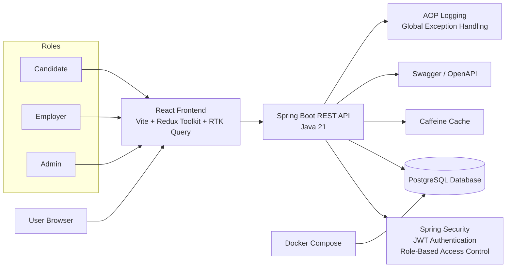

### Database Design / ERD

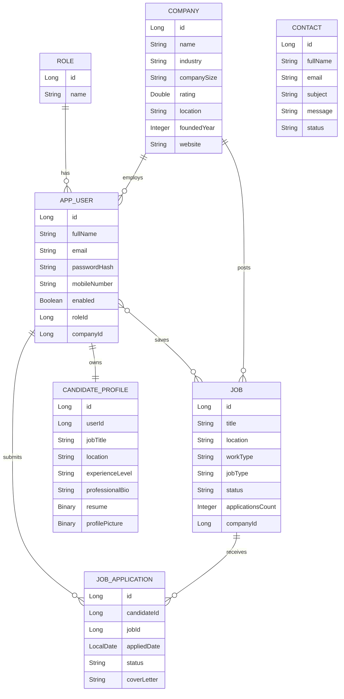

> Note: The `contacts` table is independent because contact messages can be submitted by public visitors without requiring authentication.

### Candidate Application Workflow

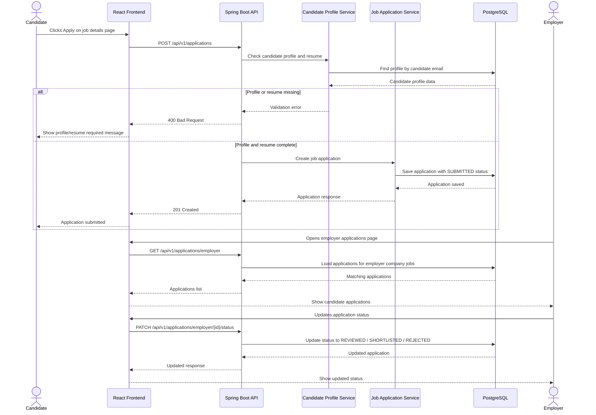

## API Overview

### Auth

```http
POST /api/v1/auth/register
POST /api/v1/auth/login
```

### Public Jobs

```http
GET /api/v1/jobs
GET /api/v1/jobs/{id}
```

### Candidate Applications

```http
POST   /api/v1/applications
GET    /api/v1/applications/me
DELETE /api/v1/applications/jobs/{jobId}
```

### Employer Applications

```http
GET   /api/v1/applications/employer
GET   /api/v1/applications/employer/jobs/{jobId}
PATCH /api/v1/applications/employer/{applicationId}/status
```

### Employer Jobs

```http
GET   /api/v1/jobs/employer
POST  /api/v1/jobs/employer
PATCH /api/v1/jobs/employer/{jobId}/status
```

### Admin Contacts

```http
GET   /api/v1/contacts/admin
PATCH /api/v1/contacts/admin/{contactId}/status
```

### Admin Companies

```http
GET    /api/v1/companies/admin
POST   /api/v1/companies/admin
PUT    /api/v1/companies/admin/{id}
DELETE /api/v1/companies/admin/{id}
```

### Admin Users

```http
GET   /api/v1/users/admin/search
PATCH /api/v1/users/admin/{userId}/role/employer
PATCH /api/v1/users/admin/{userId}/company/{companyId}
```

---

## Frontend Highlights

The frontend uses Redux Toolkit and RTK Query for API state management.

Main frontend areas:

- Public pages
- Candidate dashboard
- Employer dashboard
- Admin dashboard

### Route Protection

The frontend includes route guards for:

- Authenticated users
- Candidates
- Employers
- Admins

Unauthorized users are redirected to an access denied page.

### Dashboard Redirect

After login, users are redirected to:

```text
/dashboard
```

The app then sends them to the correct area based on role:

```text
Admin     → /admin/contacts
Employer  → /employer/dashboard
Candidate → /candidate/profile
```

---

## Local Development Setup

### Prerequisites

Make sure you have installed:

- Java 21
- Node.js
- Docker Desktop
- Maven Wrapper included in project
- PostgreSQL Docker container through Docker Compose

---

## Backend Setup

Navigate to the backend folder:

```bash
cd backend
```

Start the backend with the PostgreSQL profile:

```bash
./mvnw spring-boot:run -Dspring-boot.run.profiles=postgres
```

On Windows PowerShell:

```powershell
.\mvnw spring-boot:run "-Dspring-boot.run.profiles=postgres"
```

Backend runs at:

```text
http://localhost:8080
```

Swagger UI:

```text
http://localhost:8080/swagger-ui/index.html
```

---

## Frontend Setup

Navigate to the frontend folder:

```bash
cd frontend
```

Install dependencies:

```bash
npm install
```

Run frontend:

```bash
npm run dev
```

Frontend runs at:

```text
http://localhost:5173
```

Build frontend:

```bash
npm run build
```

---

## Database

The project uses PostgreSQL through Docker Compose.

Local database connection:

```text
Database: job_portal_api
Host: localhost
Port: 5433
Username: postgres
Password: postgres
```

JDBC URL:

```text
jdbc:postgresql://localhost:5433/job_portal_api
```

---

## Test Accounts

### Admin

```text
Email: admin@percybuilderhire.com
Password: password
```

### Candidate

```text
Email: candidate@percybuilderhire.com
Password: password
```

### Employer

```text
Email: employer@percybuilderhire.com
Password: password
```

---

## Important Workflows

### Candidate Application Workflow

```text
Candidate logs in
↓
Completes candidate profile
↓
Uploads resume
↓
Browses jobs
↓
Applies to job
↓
Tracks application status
```

### Employer Review Workflow

```text
Employer logs in
↓
Views company jobs
↓
Opens applications page
↓
Reviews candidate applications
↓
Updates application status
```

### Admin Employer Assignment Workflow

```text
Admin logs in
↓
Searches user by email
↓
Promotes user to employer
↓
Assigns employer to company
↓
Employer can manage company jobs
```

---

## Environment Configuration

The backend uses separate property files:

```text
application.properties
application-postgres.properties
application-prod.properties
```

### application.properties

Common safe settings only.

### application-postgres.properties

Local PostgreSQL development settings.

### application-prod.properties

Production deployment settings using environment variables.

---

## Screenshots

### Home Page

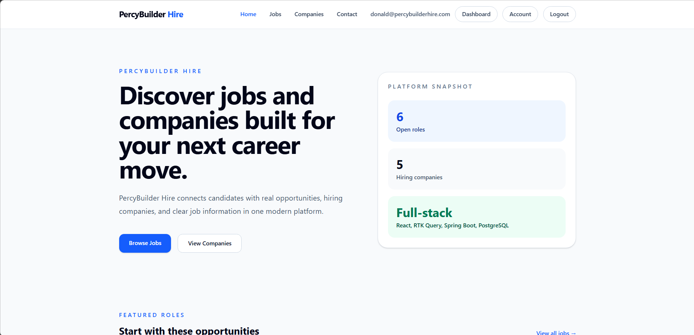

### Jobs Page

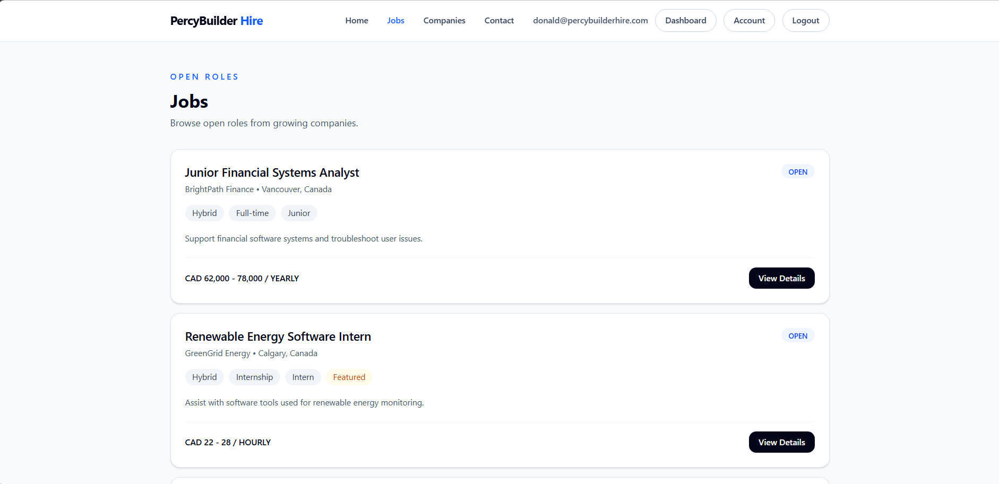

### Job Details Page

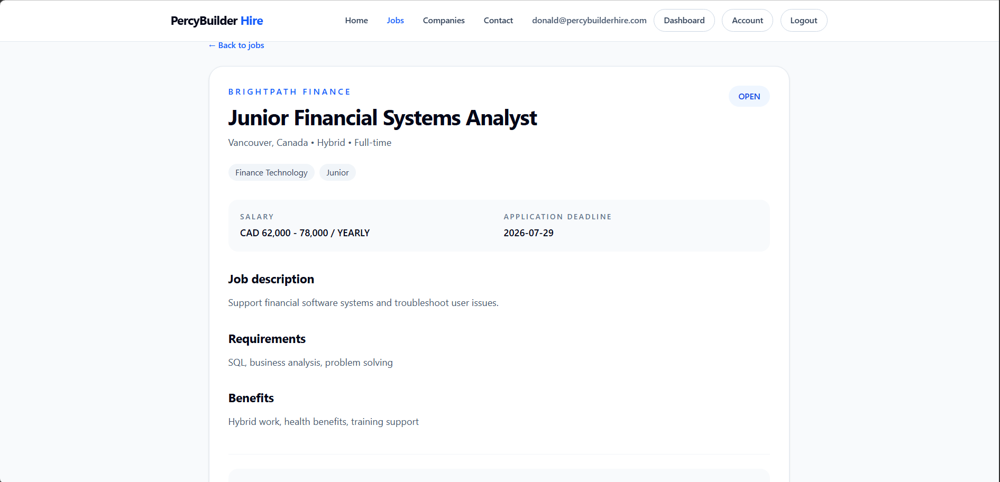

### Candidate Profile

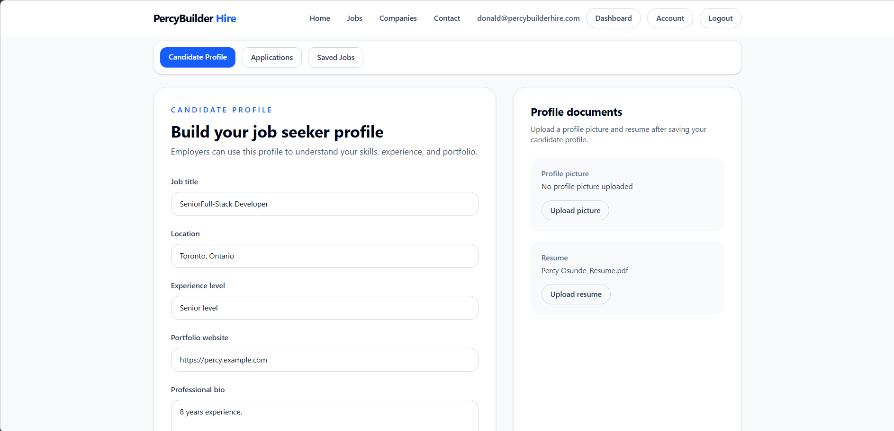

### Candidate Applications

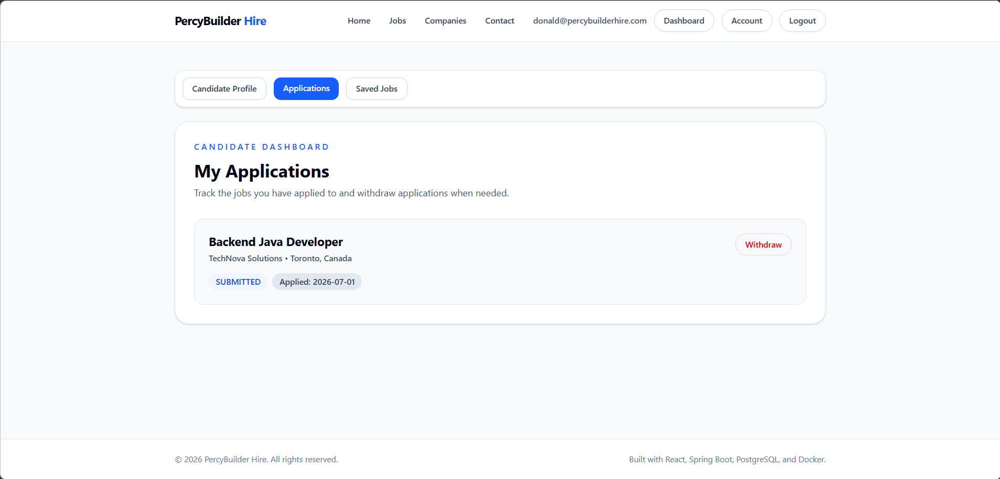

### Employer Dashboard

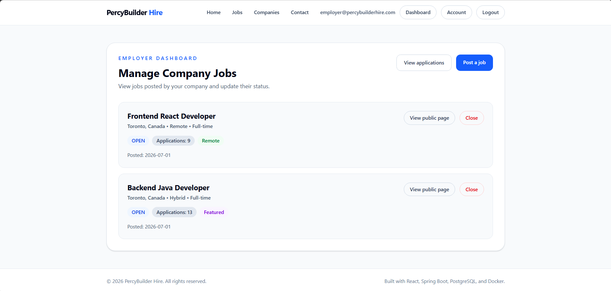

### Employer Applications

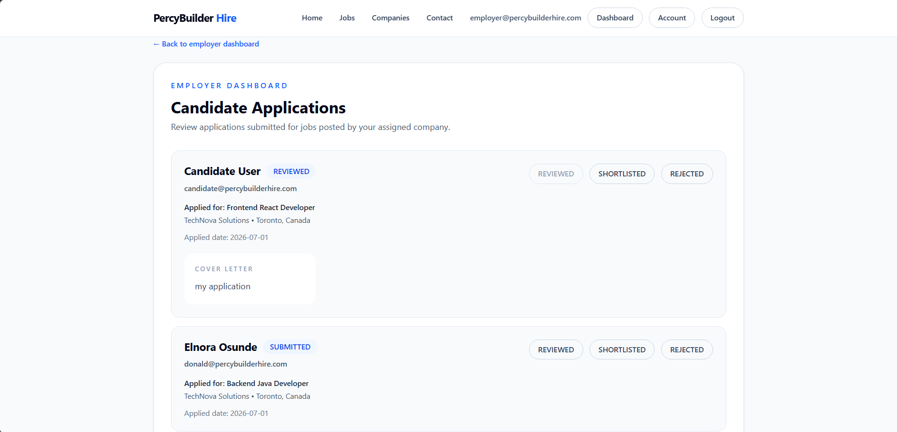

### Admin Contacts

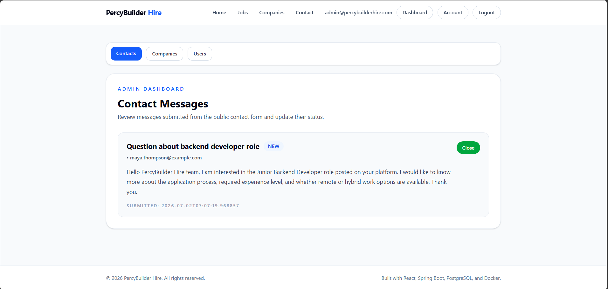

### Admin Companies

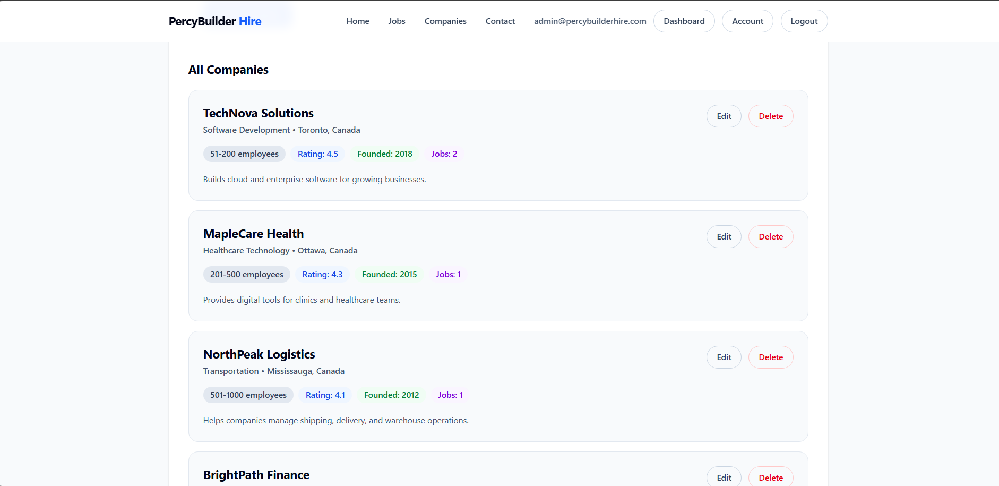

### Admin Users

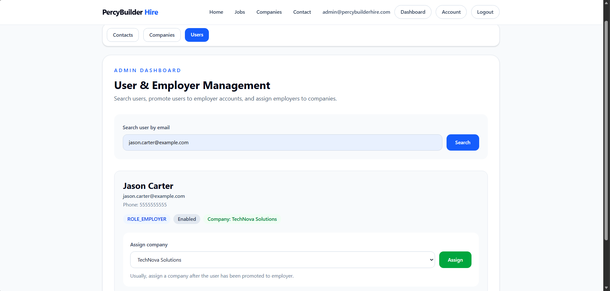

## Future Improvements

Possible future enhancements:

- Email notifications
- Employer candidate resume download
- Advanced job search filters
- Pagination for admin pages
- Application status history
- Interview scheduling
- Cloud deployment
- Automated tests

---

## Author

Percy Osunde

Full-Stack Software Developer
React | Spring Boot | Node.js | PostgreSQL | Docker | AWS Basics
